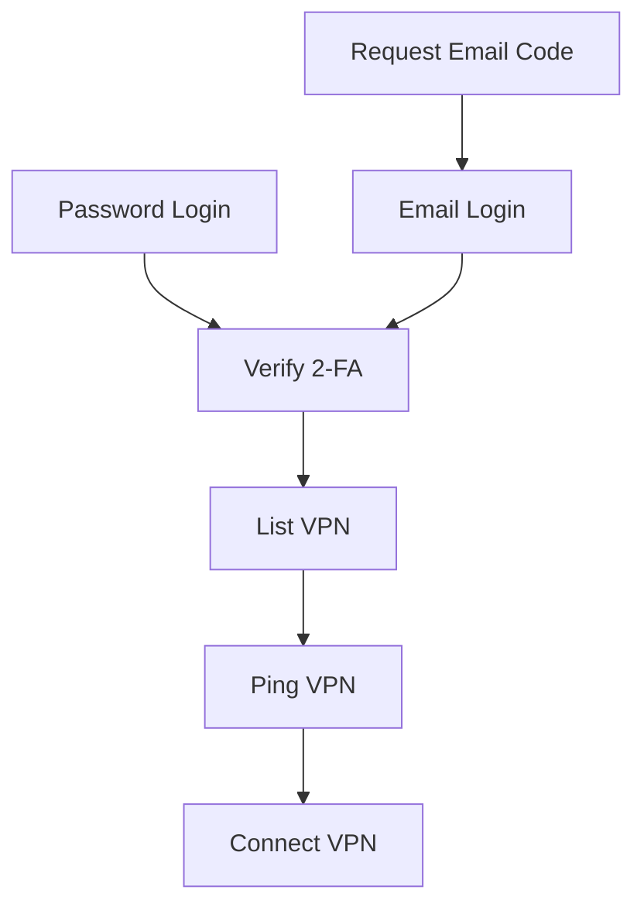
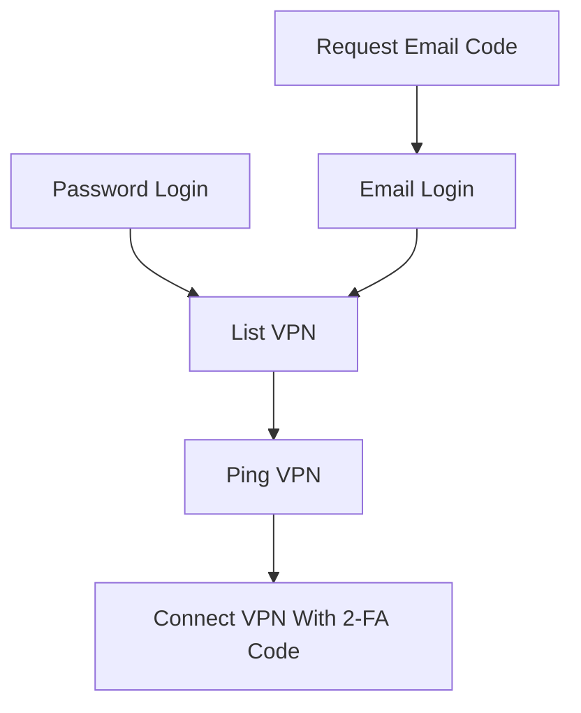

# corplink

Yet another sealsuite client

## Compile

### linux / macOS

```bash
git clone https://github.com/PinkD/corplink-rs --depth 1
cd corplink-rs

# build libwg
cd libwg
./build.sh

# if you are using Windows, you can clone and build libwg maunally
# ref: wireguard-go/Makefile:libwg

cargo build --release

# install corplink-rs to your PATH
mv target/release/corplink-rs /usr/bin/
```

### windows

See: [#34](https://github.com/PinkD/corplink-rs/issues/34)

## Usage

> root permission is required for running `wg-go` (Administrator permission on Windows)

```bash
# direct
corplink-rs config.json

# systemd
# config is /etc/corplink/config.json
systemctl start corplink-rs.service
# auto start
systemctl enable corplink-rs.service

# systemd with custom config
# config is /etc/corplink/test.json
# NOTE: cookies.json is reserved by cookie storage
systemctl start corplink-rs@test.service
```

### Note for Windows users

[wintun](6) is required for running `wg-go` in Windows. You need to download and place `wintun.dll` in the same directory as `corplink-rs` (add to PATH also works).

### Note for macOS users

macOS requires the name of TUN devices in the form of `utun[0-9]*`. You need to change `interface_name` in the config file according to this format, eg. `utun20001`.

## Config

### Minimal configuration

```json
{
  "company_name": "company code name",
  "username": "your_name"
}
```

### Typical configuration

```json
{
  "company_name": "company code name",
  "username": "your_name",
  "password": "your_pass",
  "platform": "ldap"
}
```

### Full configuration

```json
{
  "company_name": "company code name",
  "username": "your_name",
  // support sha256sum hashed pass if you don't use ldap, will ask email for code if not provided
  "password": "your_pass",
  // default is feilian, can be feilian/ldap/lark(aka feishu)/OIDC
  // dingtalk/aad/weixin is not supported yet
  "platform": "ldap",
  "code": "totp code",
  // default is DollarOS (not CentOS)
  "device_name": "any string to describe your device",
  "device_id": "md5 of device_name or any string with same format",
  "public_key": "wg public key, can be generated from private key",
  "private_key": "wg private key",
  "server": "server link",
  // enable wg-go log to debug uapi problems
  "debug_wg": true,
  // will use corplink as interface name
  "interface_name": "corplink",
  // traffic routing mode, choose between split/full tunnel
  "routing_mode": "split",
  // will use the specified server to connect, for example 'HK-1'
  // name from server list
  "vpn_server_name": "hk",
  // latency/default
  // latency: choose the server with the lowest latency
  // default: choose the first available server
  "vpn_select_strategy": "latency"
  "vpn_server_name": "HK-1"
}
```

## Analysis

[Feilian / Sealsuite / VeCorplink][1] is an enterprise VPN solution based on [wireguard-go][2].

### Non-upstream-compatible changes

Feilian version 2.0.9 added a `protocol_version` field, which needs a modified version of `wireguard-go` - [wg-corplink][5] to work.

### Typical working logic

#### Linux



#### Android



### OTP implement

Feilian uses standard [TOTP][1] for OTP. When the client's UA is Android, the server will return the token for TOTP, and the client can use standard TOTP argorithm to generate current OTP code. Passing this OTP code when requesting connection info will let us to keep the client session.

## Changelog

- 0.4.3
  - support corplink 2.2.x(by @jixiuf)
- 0.4.2
  - add OIDC platform support(by @Jinxuyang)
- 0.4.1
  - fix Windows device up
  - fix undefined behavior for c str
- 0.4.0
  - embed wg-go with cgo
- 0.3.6
  - fix wg-corplink not exit(by @LionheartLann)
  - fix session is expired(by @XYenon)
- 0.3.5
  - fix empty login method list
  - fix write long data to uapi(by @nolouch)
  - add vpn server name option(by @nolouch)
- 0.3.4
  - fix cookie out of date
- 0.3.3
  - add feishu tps login support
  - upgrade dependency
- 0.3.2
  - separate `cookies.json`
  - add debug flag for wg-go
- 0.3.1
  - fix mac support(on [wg-corplink][5])
- 0.3.0
  - add windows/mac support
- 0.2.3
  - fix empty `protocol_version`
  - add privilege check
- 0.2.2
  - fix wg-corplink not exit if corplink-rs exit accidently
- 0.2.1
  - use modified wireguard-go
    - don't generate config anymore
  - remove `conf_name/conf_dir` and add `interface_name/wg_binary` in config
- 0.1.4
  - get company name from company code automatically
  - support ldap
  - check and skip tcp wg server
  - optimize config
- 0.1.3
  - disconnect if wireguard handshake timeout
- 0.1.2
  - support time correction for totp
- 0.1.1
  - support generate wg key
- 0.1.0
  - first version

## Links

- [wireguard-go][2]
- [TOTP][3]
- [Python implementation][4]
- [wg-corplink][5]
- [wintun][6]
- [Tauri][7]

## License

This software is released under the GNU GPL-2.0 License.

[1]: https://www.volcengine.com/product/vecorplink
[2]: https://github.com/WireGuard/wireguard-go
[3]: https://en.wikipedia.org/wiki/Time-based_one-time_password
[4]: https://github.com/PinkD/corplink
[5]: https://github.com/PinkD/wireguard-go
[6]: https://www.wintun.net/
[7]: https://github.com/tauri-apps/tauri
